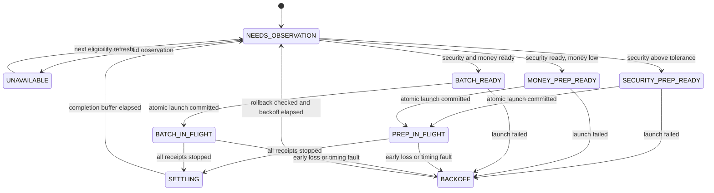

# Multi-target scheduler design

Status: proposed architecture only. This document changes no game script.

## Scope and invariants

The new entry point is `multi-manager.js`. `manager.js` remains unchanged and
usable as the stable single-target fallback. The two managers must not run at
the same time; `multi-manager.js` detects an active `manager.js` or a second
`multi-manager.js`, reports the conflict, and launches no work. It must never
kill the fallback automatically.

Non-negotiable invariants:

1. Each target is an independent state machine with at most one committed job
   group in flight.
2. All rooted RAM runners participate in one global allocation ledger.
3. The configured home RAM reserve is removed from allocatable RAM before any
   planning.
4. Every logical job group is completely planned before the first `ns.exec`.
5. A batch group contains every H/W/G/W job for every included batch. Failure
   to allocate any job rejects the whole group.
6. Ready, profitable, complete batches are considered before any target
   preparation.
7. Preparation may use RAM left idle by the batch pass, but may not delay a
   complete batch the scheduler can already identify.
8. A target is never declared prepared from a predicted future state. After any
   group finishes or fails, the scheduler waits for settlement and obtains a
   fresh observation before choosing that target's next phase.
9. Every unallocated amount of usable RAM has a structured, displayable reason.

The first implementation favors correctness and inspectability over cross-wave
pipelining on a single target. Concurrency comes from operating on different
targets. Overlapping independently planned groups on the same target requires
probabilistic state projection and is explicitly out of scope for v1.

## Existing code and compatibility

The scheduler reuses the stable read-only/runtime helpers in `hacking-lib.js`:
`scanNetwork`, `rootAvailableServers`, `deployWorkers`, `getRunners`,
`inspectTarget`, `loadWorkers`, `buildPreparedBatch`, `weakenThreadsForHack`,
and `weakenThreadsForGrow`. Multi-target orchestration must not be added to
`manager.js`.

All three workers already have the right single-operation contract, confirmed
identical across `worker-hack.js`, `worker-grow.js`, and `worker-weaken.js`:

```text
[target, requestedDelay, plannedAt, groupOrBatchId, label]
```

Each performs exactly one `ns.hack` / `ns.grow` / `ns.weaken`, subtracting
launch skew from `requestedDelay` via `plannedAt` and passing the remainder as
`additionalMsec`. Arguments 3 and 4 are written by the manager and never read
by the worker. That is what lets the new scheduler tag and recover its own
processes without changing worker behavior — and it is why the workers must
stay at one `ns` call each: script RAM is charged per referenced API, per
thread.

Two existing functions are deliberately *not* reused:

- `allocateJobs()` reads live Netscript state (`freeRam`) during allocation, so
  its result is not a pure function of a snapshot.
- `launchAtomic()` returns a flat PID array with no durable runner/logical-job
  association, so in-flight work cannot be reconciled per fragment.

Both remain correct for `manager.js`. The multi-target manager needs a
snapshot-based pure allocator and a receipt-producing launch adapter. Those are
new functions in new modules, not behavioral changes to the fallback path.

## Proposed modules

```text
src/
  manager.js                  unchanged single-target fallback
  hacking-lib.js              existing helpers; preserve current behavior
  worker-hack.js              unchanged one-operation worker
  worker-grow.js              unchanged one-operation worker
  worker-weaken.js            unchanged one-operation worker
  multi-manager.js            readable Netscript loop and status display
  multi-runtime.js            all Netscript reads, exec, kill, and PID polling
  multi-planning.js           pure job timing and global RAM allocation
  multi-scheduler.js          pure target reducer and scheduling policy
tests/
  multi-planning.test.mjs
  multi-scheduler.test.mjs
  multi-runtime.test.mjs      fake-NS tests for the impure adapter
```

`multi-manager.js` should read like an event loop, not contain allocation or
state-transition detail:

```text
refresh infrastructure when due
poll and reconcile in-flight receipts
observe quiescent targets that need observation
snapshot all runners once
ask the pure scheduler for one decision
revalidate and commit one complete job group, or record an idle decision
render status
sleep until the next useful event or the polling cap
```

Committing at most one group per loop keeps the plan/commit window short. After
a successful commit, the next iteration takes a new RAM snapshot before planning
another target.

## Core data model

### Target record

```js
{
  host,
  phase,
  generation,
  observation: {
    observedAt,
    money,
    maxMoney,
    security,
    minSecurity,
    hackTime,
    growTime,
    weakenTime,
  },
  economics: {
    preparedBatch,
    expectedMoneyPerSecond,
  },
  activeGroupId,
  settleAfter,
  backoffUntil,
  dirtyReason,
}
```

`generation` increments on every accepted fresh observation. Every candidate and
job group carries the generation it was planned from. A candidate whose
generation no longer matches is stale and cannot be launched.

`economics.preparedBatch` is a planning model, not asserted target state.
Expected effects may be displayed and used to validate the internal landing
order of one closed group, but they never move a target to a ready phase.

### Job group, logical job, process receipt

A job group is the atomic scheduling unit:

```js
{
  id,
  purpose,             // "batch", "security-prep", or "money-prep"
  target,
  targetGeneration,
  plannedAt,
  jobs,
  expectedValue,
  expectedLastEndAt,
}
```

A batch group holds one or more complete batches, each with H, W1, G, W2. A
money-prep group holds grow plus its compensating weaken. A security-prep group
may be a single weaken. Security prep may make partial progress toward
preparation; an H/W/G/W batch is never partial.

A logical job may split across runners. Each launched fragment gets a receipt:

```js
{
  receiptId,
  groupId,
  logicalJobId,
  target,
  operation,
  runner,
  threads,
  ram,
  pid,
  plannedAt,
  expectedStartAt,
  expectedEndAt,
  status,              // launched, finished-unverified, lost, killed, late
}
```

The receipt ledger is the source of truth for manager-owned work in flight.
Current server money/security is never used to pretend those effects already
occurred.

### Runner snapshot and private RAM ledger

The runtime adapter takes one runner snapshot per loop:

```js
{ host, maxRam, usedRam, homeReserve, allocatableRam, workersAvailable }
```

For `home`, `allocatableRam` is `max(0, maxRam - usedRam - configuredHomeReserve)`.
All other rooted runners use zero reserve. Runners missing worker files are
excluded until deployment succeeds.

The pure allocator copies these values into a private ledger, orders logical
jobs deterministically, splits threads across runners, and subtracts RAM only
from the private copy. It returns either every thread of every job plus the
resulting ledger, or no allocation and a structured rejection describing total
shortage, per-runner fragmentation, or missing worker availability. The input
ledger is untouched on failure. Integer RAM units internally avoid
floating-point boundary errors.

## Per-target state machine



Leaving `NEEDS_OBSERVATION` is allowed only when the target has no live or
uncertain receipt and its settlement time has passed. If a server becomes
invalid while jobs are in flight, the scheduler keeps tracking those jobs, then
observes and classifies it; it does not discard receipts.

Only one of `PREP_IN_FLIGHT` or `BATCH_IN_FLIGHT` may exist per target. Other
targets continue through their own state machines while that target is locked.

## Scheduling policy

The pure scheduler receives target records, a runner snapshot, the in-flight
ledger, configuration, and `now`. It returns exactly one of: a fully allocated
batch group, a fully allocated prep group, or an idle decision with rejection
evidence.

### Pass 1: complete profitable batches

1. Select targets in `BATCH_READY` with no active group, a fresh observation, a
   matching generation, and positive expected return.
2. Rank by expected dollars per second under the manager's actual H/W/G/W model
   (the `buildPreparedBatch` economics, which pay for grow and both weakens).
   Hostname is the final deterministic tie-breaker.
3. For each candidate in rank order, find the largest wave up to `maxBatches`
   that fits the global private ledger.
4. Return the first allocatable wave. Every included batch contains all four
   operations.
5. If a higher-ranked target cannot fit, continue checking smaller complete
   batches for other targets before considering prep.

The scheduler never drops a grow or weaken to make a batch fit. Reducing the
number of complete batches in a wave is allowed. Reducing the hack fraction is
allowed only through the existing bounded batch-sizing policy, and the result
must still be complete and profitable.

### Pass 2: preparation from otherwise-idle RAM

Prep candidates are examined only after every eligible complete batch has been
rejected by the current global ledger.

Security prep is a complete weaken sized to available capacity. Money prep is
always an atomic grow plus compensating weaken. Prep targets rank by prepared
economics, then by time spent waiting, so a large low-value target cannot
permanently starve a smaller useful one.

If a ready batch is waiting only on manager-owned RAM that will soon be
released, the scheduler computes its earliest feasible start from the receipt
release calendar. A tentative prep allocation is rejected when it would move
that start later; the RAM is reported as `RESERVED_FOR_BATCH_WINDOW`, not
unexplained idle. This guard applies only to already-observed `BATCH_READY`
targets — the scheduler must not assume an in-flight target will emerge ready.

When no ready batch is waiting, prep may fill currently free RAM on another
target. The next loop takes a new snapshot and again starts with the batch pass.

## Observation, projection, and state consistency

Three concepts stay strictly separate:

- **Observed state:** a timestamped server snapshot read while quiescent.
- **Planned effects:** the H/G/W landing sequence inside an unlaunched group.
- **In-flight effects:** explicit receipts for a committed group whose real
  result is still unknown.

Guards against stale-state scheduling:

1. **Target lock:** no second group is planned for a target with any committed
   or uncertain receipt.
2. **Fresh-observation barrier:** every finished, killed, lost, or late group
   leads to `NEEDS_OBSERVATION`; predicted effects never lead to `BATCH_READY`.
3. **Generation token:** a group is valid only for the exact observation that
   created it.
4. **Observation TTL:** an old but matching observation is refreshed before
   launch.
5. **Commit-time target check:** immediately before the first `exec`, the
   runtime confirms the target is still valid and its readiness classification
   is still within money/security tolerances.
6. **Commit-time RAM check:** runner free RAM, home reserve, and worker
   availability are rechecked against the allocation.
7. **Closed-group timing:** the only future state assumed during launch is the
   planned landing order within that group. No later group builds on it.
8. **Post-group settlement:** the target is not observed until all fragments
   have stopped and the completion buffer has elapsed.

Hack success is probabilistic, so even a perfectly timed batch may not restore
predicted money. That is expected; the fresh observation picks the next phase.

## Atomic launch and rollback

`multi-runtime.js` launches one group as follows:

1. Revalidate target generation and the exact runner allocation.
2. Choose a common `plannedAt`.
3. Ensure the configured launch lead leaves a safety margin for every fragment.
   If the margin is exhausted, launch nothing and replan.
4. Launch fragments in deterministic timing order, recording runner, PID, and
   logical job identity after each successful `ns.exec`.
5. If any `exec` returns zero, kill every PID already launched for that group.
6. Poll each killed PID to verify it stopped. Regardless of apparent rollback
   success, mark the target dirty and require a fresh observation after backoff.
7. Publish receipts to the in-flight ledger only after the whole group launches.
   On failure, retain failure/rollback receipts for diagnosis.

The launch is atomic with respect to scheduler intent, not game effects. A
rollback can race a worker whose delay has already expired — which is precisely
why launch lead, rollback verification, target quarantine, and re-observation
are all required together.

On startup, scan `ns.ps` on rooted runners for worker arguments carrying a
unique multi-manager prefix in argument 3. Recovered processes are tracked to
termination, but their targets enter a recovery/observation path rather than
trusting reconstructed future state. Unrecognized processes still consume RAM
through `usedRam`; if one can be identified as mutating a managed target, that
target is quarantined.

## In-flight reconciliation

The runtime polls every receipt by runner and PID:

- Still running before its expected end → remains `launched`.
- Disappears near or after its expected end → `finished-unverified`.
- Disappears materially early → `lost`.
- Runs past the late tolerance → `late`.

The scheduler does not need to distinguish successful completion from every kill
condition to stay safe. Any terminal receipt keeps the target locked until all
sibling fragments are terminal, then forces a fresh observation. Early loss or
lateness additionally records a timing fault and applies backoff.

The loop wakes at the earliest of: infrastructure refresh, receipt poll cap,
expected receipt end, settlement deadline, observation TTL, or backoff expiry. A
short maximum polling interval keeps manual kills and external interference
visible without busy-looping.

## Explaining idle RAM

Planning functions return rejection evidence, not just `null`. The status model
distinguishes:

- configured home reserve;
- RAM used by manager-owned in-flight jobs;
- RAM used by other processes;
- scheduler-free RAM allocated by the current decision; and
- scheduler-free RAM left idle.

| Code | Meaning |
| --- | --- |
| `NO_ELIGIBLE_TARGETS` | No rooted money target is currently eligible. |
| `ALL_TARGETS_BUSY` | Every useful target has a group in flight or is settling. |
| `WAITING_FOR_OBSERVATION` | A target cannot be classified safely yet. |
| `NO_PROFITABLE_BATCH` | Ready targets exist, but none passes the profitability rules. |
| `COMPLETE_BATCH_TOO_LARGE` | No complete H/W/G/W batch fits current free RAM. |
| `PREP_GROUP_TOO_LARGE` | Neither a weaken prep nor a grow/weaken prep group fits. |
| `RUNNER_FRAGMENTATION` | Aggregate RAM suffices but per-runner thread placement does not. |
| `RESERVED_FOR_BATCH_WINDOW` | Prep would delay an already-ready complete batch. |
| `WORKERS_NOT_DEPLOYED` | Nominal runner RAM is unavailable until deployment succeeds. |
| `STALE_SNAPSHOT` | Target or runner data changed during plan/commit validation. |
| `LAUNCH_BACKOFF` | A recent launch/timing failure is being reconciled. |
| `CONFLICTING_MANAGER` | Another manager instance owns scheduling. |
| `BELOW_SMALLEST_THREAD` | Remaining fragments cannot fit one worker thread. |

The display states both quantity and cause:

```text
Scheduler-free: 22.4 GB
Idle: 14.0 GB reserved for a ready batch window at 12:41:08
Idle: 8.4 GB fragmented; largest runner fragment is below one grow thread
Home reserve: 8.0 GB (intentional, not scheduler-free)
```

When several candidates fail for different reasons, show the dominant reason
with a short count; per-candidate detail belongs in the tail log or report mode.

## Timing failure modes

| Failure mode | Detection | Safe response |
| --- | --- | --- |
| Planning or `exec` takes longer than the launch lead | Compare now against the group's latest safe launch time before every `exec` | Abort before launch, or roll back the group and raise the lead. |
| Launch skew exceeds a worker's requested delay | Worker delay clamps to zero; runtime safety margin exhausted | Do not launch the fragment; roll back the group and re-observe. |
| Event-loop pause or UI lag collapses H/W/G/W landing gaps | Receipt timestamps pass expected boundaries; configured gap below observed jitter | Mark timing fault, wait for all jobs, re-observe, report the gap/lead as unsafe. |
| Hacking level or security changes operation durations after planning | Commit-time metrics differ, or a job stays live outside tolerance | Reject the stale plan, or quarantine the completed group and re-observe. |
| Split fragments of one logical job finish at slightly different times | Track every fragment, not one logical PID | Keep the target locked through the last fragment plus settlement buffer. |
| System/browser clock changes (`Date.now()`) | Time moves backward or jumps unexpectedly relative to the last loop | Stop new launches, classify active groups as timing-uncertain, reconcile, re-observe. |
| Completion buffer too short for state visibility | Repeated post-group observations disagree immediately | Increase buffer/backoff; never schedule from the disputed observation. |
| A process runs materially later than planned | PID live after expected end plus tolerance | Mark `late`, keep its RAM and target locked, display the overrun. |

## State-consistency and launch failure modes

| Failure mode | Detection | Safe response |
| --- | --- | --- |
| Runner RAM changes between snapshot and launch | Commit-time free-RAM check, or `ns.exec` returns zero | Launch nothing if caught early; otherwise kill all fragments in the group and replan. |
| One fragment fails after earlier fragments launched | `ns.exec` returns zero partway through | Kill all recorded PIDs, verify rollback, mark target dirty, require observation. |
| Rollback loses a race with an operation starting or finishing | Kill fails, PID vanishes unexpectedly, or lead expired | Assume target state may have changed; quarantine until receipts settle, then observe. |
| Worker manually killed or runner disappears | PID gone before expected completion | Mark `lost`; do not apply its predicted effect or launch more work on that target. |
| Hack outcomes differ from expectation | Fresh money observation differs from the planning model | Reclassify from observed state; usually money or security prep. |
| Another script mutates a target | Observation changes with no matching receipt, or a foreign worker targets it | Invalidate the generation, quarantine and re-observe, report interference. |
| Target state changes after observation but before commit | Commit-time money/security/readiness check differs | Discard the candidate without launching. |
| Target becomes invalid, unrooted, or inaccessible | Target validation fails | Track existing receipts to terminal state, then mark unavailable. |
| Worker deployment missing or script RAM changed | Deployment/file/RAM preflight differs from snapshot | Exclude the runner, invalidate allocations, refresh infrastructure, replan. |
| Manager restarts while tagged workers run | Startup `ns.ps` scan finds the multi-manager prefix | Recover receipts conservatively, wait for completion, then observe. |
| `manager.js` and `multi-manager.js` overlap | Startup and periodic process scan | Launch nothing, report `CONFLICTING_MANAGER`, never kill the fallback. |
| Growth analysis returns non-finite or impossible values | Validate all computed threads, RAM, times, expected value | Reject the candidate with a calculation reason; never coerce a partial group. |
| Target ranking goes stale as player stats change | Ranking generation/TTL expires | Recompute before selecting or committing work. |

## Tests that do not require Bitburner

Most correctness rules live in pure modules and run under Node.

### Pure scheduler tests

- Targets transition independently; events for target A never change target B.
- A target with an active or uncertain receipt produces no new candidate.
- A terminal group always passes through settlement and fresh observation before
  becoming ready.
- Stale generations and expired observations are rejected.
- Batch candidates are always considered before prep candidates.
- A lower-ranked complete batch is chosen when a higher-ranked one cannot fit.
- Prep is selected only from batch-pass residual capacity.
- The no-delay guard rejects prep that would postpone a known batch window.
- Aging breaks prep ties without outranking an allocatable profitable batch.
- Every idle decision carries at least one structured reason.
- Conflicting-manager and launch-backoff states produce no launch decision.

### Pure planning and allocation tests

- Home reserve is always excluded, including when home is already heavily used.
- Total allocated RAM never exceeds any runner snapshot.
- Split allocations preserve the exact requested thread count.
- Failure to place one thread returns no allocation and leaves the input ledger
  unchanged.
- H/W/G/W groups never omit an operation or a compensating weaken.
- Money prep never contains grow without its weaken.
- Largest-wave reduction removes whole batches only.
- Allocation is global across all rooted runners and deterministic for identical
  input.
- Fragmentation and below-one-thread cases report the correct idle reason.
- Planned landing order is H, W1, G, W2 with the configured gaps.
- Launch deadline and expected-end math handles skew and boundaries.
- Randomized invariant tests never over-allocate RAM, cross a target lock, or
  return a partial logical group.

### Adapter tests with a fake Netscript object

Not pure, but still no game required:

- Runner and target snapshots map Netscript values into immutable planner input.
- Commit revalidation rejects changed RAM or target state.
- A partway `exec` failure kills every earlier PID in that group.
- Successful receipts retain the correct runner/PID/logical-job association.
- Early disappearance, normal completion, lateness, and kill failure each
  produce the correct reconciliation event.
- Startup process scanning recovers only the multi-manager's tagged workers.
- Worker deployment failure excludes the runner.

### What still requires in-game validation

Node tests cannot prove real Bitburner operation timing, `additionalMsec`
behavior under load, real PID lifecycle semantics, actual hack/grow/weaken
effects, SCP/deployment behavior, or status readability in the script log. Those
need manual validation in Bitburner 3.0.2. Claude cannot execute Bitburner and
must not claim in-game integration behavior was tested.

## Tooling the implementation phase inherits

`package.json` already provides what the implementation needs:

```
npm test              # node --test
npm run check         # tsc --noEmit
npm run format        # prettier --write src/ tests/
```

Three consequences for the layout above:

1. `node --test` discovers `**/*.test.?(c|m)js` by default, so the proposed
   `tests/*.test.mjs` names run with no runner configuration. The `tests/`
   directory does not exist yet; creating it with the first pure-planning test
   is the natural first implementation commit.
2. `tsconfig.json` already includes `tests/**`, so tests are type-checked by
   `npm run check` alongside `src/`. Fake-NS adapter tests should type their
   fake against the real `NS` surface rather than `any` where practical.
3. `npm run check` currently fails with roughly 175 pre-existing errors, nearly
   all `TS7006` implicit-any on JSDoc-annotated JS under `"strict": true`. That
   is the existing baseline, not a regression. The new `multi-*.js` modules
   should add nothing to it — the pure modules take plain data structures and
   are the easiest code in this repository to annotate fully. Judge a change by
   whether the error count and set of failing files grew, not by whether the
   command exits zero.

## Requirement traceability

| Requirement | Design mechanism |
| --- | --- |
| Independent state machine per target | `TargetRecord`, reducer, one target lock per active group |
| Global RAM allocation | One immutable runner snapshot and one private global ledger |
| Complete profitable batches before prep | Two-pass candidate selection |
| Prepare another target with idle RAM | Prep pass plus batch-window no-delay guard |
| Track jobs in flight | Per-fragment process receipt ledger |
| Never infer future state from current state | Generation tokens, explicit receipts, target lock, fresh-observation barrier |
| Explain idle RAM | Structured allocation rejections and idle reason codes |
| Keep `manager.js` fallback | Separate entry point and new modules; no fallback behavior changes |
| Never launch partial batches | Atomic job groups, all-or-none allocation and rollback |
| Preserve home RAM | Reserve removed in every runner snapshot and commit revalidation |
| Test without Bitburner | Pure reducer/planner/allocator tests plus fake-NS adapter tests |
